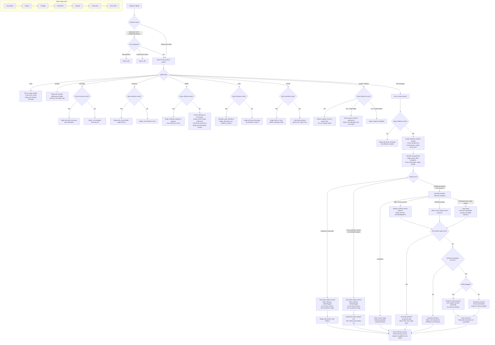

# Telegram Bot Chat Flow

This diagram reflects the current implementation in `apps/bot/src/bot.ts` and
`packages/core/src/agent.ts`.

## Important Flow Invariants

- Free text in home never starts a reflection. The student must use `/reflect`.
- `/new` discards open reflections and returns home; it does not immediately create a replacement reflection.
- `/model` is available only when no reflection is open. Model assignment is fixed per reflection once it starts.
- Safety pauses do not advance, complete, or discard the reflection. They still create an open `safety_concerns` record and mark the reflection `safetyFlagged`.
- The deterministic controller owns stage movement, answer storage, safety, loop repair, and summary eligibility. The model only helps judge sufficiency or phrase guarded replies.
- Bot turns are persisted after the updated session is saved, so bot reply turns use the resulting stage.

## Main Trace Attributes

- `reflection.stage`: stage before processing the student message.
- `reflection.next_stage`: stage after processing the turn.
- `reflection.reply_kind`: `normal` or `safety_followup`.
- `reflection.safety_flagged`: whether the current turn had a safety concern.
- `reflection.safety_pause`: true when a safety follow-up paused the reflection.
- `reflection.model.variant`: assigned model for the reflection.
- `reflection.model.assignment_source`: `manual` or `default`.
- `reflection.model.comparison_group`: currently `in_situ_manual`.
