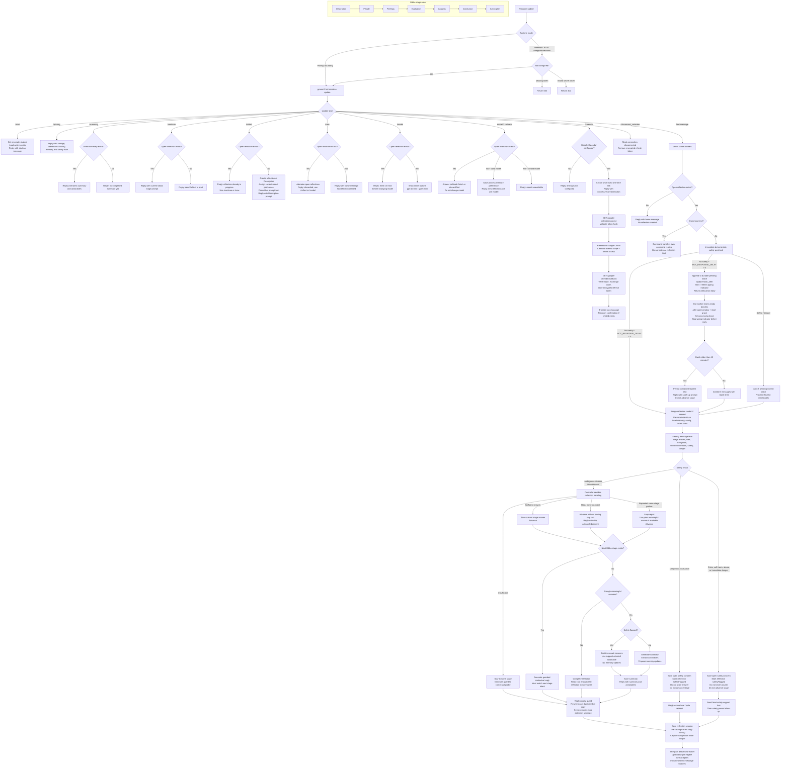

# Telegram Bot Chat Flow

This diagram reflects the current implementation in `apps/bot/src/bot.ts` and
`packages/core/src/agent.ts`.

## Important Flow Invariants

- Free text in home never starts a reflection. The student must use `/reflect`.
- `/new` discards open reflections and returns home; it does not immediately create a replacement reflection.
- `/model` is available only when no reflection is open. Model assignment is fixed per reflection once it starts.
- `/calendar` starts Google Calendar account linking for the Telegram student. The bot creates a short-lived one-time OAuth link, stores only a hash of the link token, and binds the Google callback through OAuth `state`.
- Google Calendar linking requests offline access for Calendar event creation/editing. The stored refresh token is encrypted before persistence and is associated with the student's `student_profiles.id`.
- `/calendar` shows the current Calendar connection state: no connection creates a connect link, an active connection creates a reconnect/update-permissions link, and `needs_reauth` asks the student to reconnect.
- Telegram inline keyboard buttons are used only for HTTPS OAuth URLs. For local HTTP URLs such as `http://localhost:8787`, the bot sends the OAuth URL as plain text because Telegram rejects localhost URLs in inline buttons.
- `/disconnect_calendar` marks the student's Google Calendar connection disconnected and clears the stored encrypted refresh token.
- Commands bypass the normal text debounce. Stale command bursts are collapsed so the bot does not replay a wall of old command replies after downtime.
- Normal reflection text is debounced through `telegram_pending_batches` when `BOT_RESPONSE_DELAY` is greater than `0`. The default delay is `5` seconds, with supported values from `0` to `30`.
- Buffered normal text starts a best-effort Telegram `typing` indicator immediately. The bot refreshes it about every 4 seconds while the batch is pending.
- Follow-up normal text for the same chat/reflection briefly pauses typing refreshes for 2 seconds, then resumes, so the user sees the bot as revising the pending response.
- Typing indicators are process-local UX only. They stop when the batch flushes, safety bypasses the batch, `/new` cancels the reflection, stale catch-up replies are sent, or debounce is disabled.
- The worker waits a short extra grace after `flush_after` before claiming a batch, so messages that arrive exactly on the boundary can still join the batch.
- The same bot process runs only one pending-batch flush at a time. If a scheduled tick fires while a previous flush is still running, that tick is skipped.
- Claimed pending batches receive a 60-second processing lease. If the bot dies after claim but before completion, the expired `processing` row becomes claimable again on a later worker pass.
- Safety-looking text bypasses debounce, cancels any pending normal batch for that reflection, and is processed immediately.
- Stale normal batches older than 15 minutes receive a catch-up prompt instead of being treated as live reflection input.
- Safety pauses do not advance, complete, or discard the reflection. They still create an open `safety_concerns` record and mark the reflection `safetyFlagged`.
- The deterministic controller owns stage movement, answer storage, safety, loop repair, and summary eligibility. The model only helps judge sufficiency or phrase guarded replies.
- Exact repeated normal bot replies are rewritten before persistence. This guard is surface-level output hygiene; semantic loop detection still counts repeated same-stage probes even when wording differs.
- Bot turns are persisted after the updated session is saved, so bot reply turns use the resulting stage.
- Telegram reply splitting is delivery-only. Core handling, persistence, LangWatch logical outputs, loop detection, and eval transcripts still see one logical bot reply; only eligible normal reflection replies may be delivered as two Telegram bubbles.
- `BOT_REPLY_SPLIT_RATE` controls deterministic delivery splitting from `0` to `1`, defaults to `0.2`, and uses stable context-derived seeds so tests and replay behavior are reproducible.
- Delivery splitting only happens at sentence boundaries and never applies to safety, summary/actionable, command, home, stale backlog, `/reflect`, `/continue`, `/model`, `/new`, or loop-repair replies.

## Contributor Notes

- Google Calendar linking requires `GOOGLE_CLIENT_ID`, `GOOGLE_CLIENT_SECRET`, `GOOGLE_TOKEN_ENCRYPTION_KEY`, and `PUBLIC_BASE_URL`. `PUBLIC_BASE_URL + /google-calendar/callback` must exactly match a Google OAuth authorized redirect URI.
- Keep the worker's processing lease and in-process scheduler guard paired: the lease recovers after crashes, while the guard prevents overlapping flushes in one bot process.
- Known follow-up: the worker should re-check live batch/reflection state before persisting and sending a claimed batch, so mid-flight safety or `/new` cancellation cannot be overwritten by an older normal reply.

## Main Trace Attributes

- `reflection.stage`: stage before processing the student message.
- `reflection.next_stage`: stage after processing the turn.
- `reflection.reply_kind`: `normal` or `safety_followup`.
- `reflection.safety_flagged`: whether the current turn had a safety concern.
- `reflection.safety_pause`: true when a safety follow-up paused the reflection.
- `reflection.model.variant`: assigned model for the reflection.
- `reflection.model.assignment_source`: `manual` or `default`.
- `reflection.model.comparison_group`: currently `in_situ_manual`.
- `reflection.reply_guard.exact_repeat`: whether the normal reply matched recent bot copy.
- `reflection.reply_guard.action`: guard outcome such as `none`, `alternate_probe`, or `stage_aligned_fallback`.
- `reflection.loop.semantic_probe_count`: same-stage probe count used for loop repair.
- `reflection.loop.semantic_loop`: whether the current turn is in loop-repair territory.
- `telegram.batch.message_count`: number of user messages combined into the processed turn.
- `telegram.batch.first_message_at`: timestamp of the first buffered message.
- `telegram.batch.last_message_at`: timestamp of the final buffered message.
- `telegram.batch.debounce_ms`: quiet-window delay used for the flushed batch.
- `telegram.batch.stale`: whether the batch was too old for normal reflection processing.
- `telegram.batch.cancelled_by_safety`: whether safety bypass cancelled pending normal text.
- `telegram.delivery.split`: whether Telegram delivery split a logical bot reply into multiple messages.
- `telegram.delivery.message_count`: number of Telegram messages delivered for the logical reply or replies.
- `telegram.delivery.split_rate`: configured deterministic split rate used for delivery planning.
